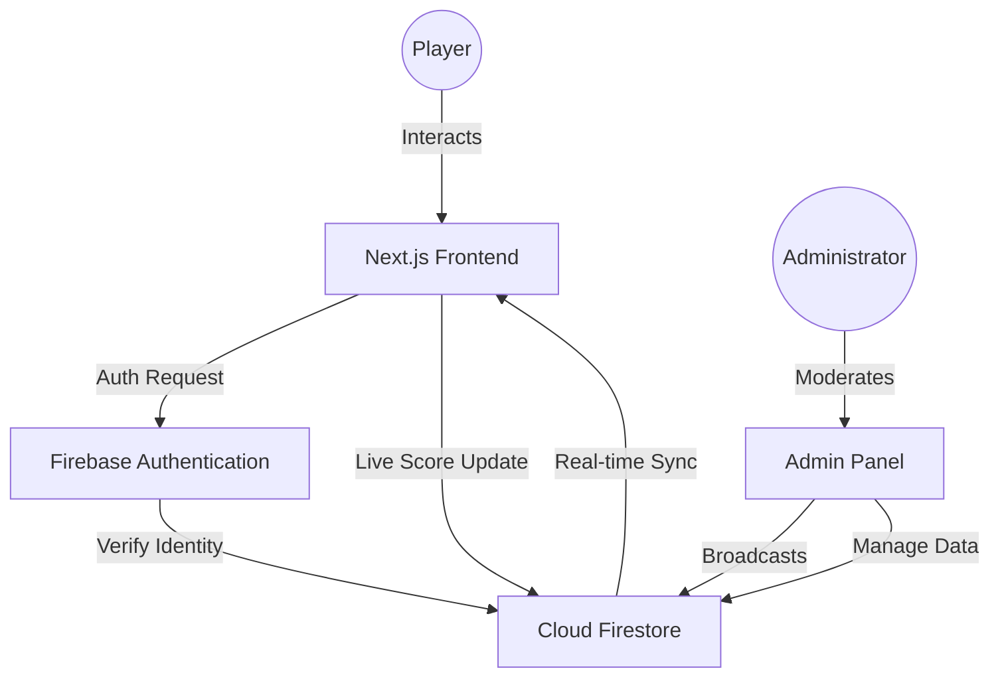

# 6GAMER: Technical Documentation and Project Report

## Part 1: Academic PowerPoint Presentation Structure
**Project Title**: 6GAMER – A Premium Web-Based Gaming Platform
**Technologies**: Next.js 15, Firebase Firestore, Firebase Authentication, Tailwind CSS 4, Framer Motion
**Deployment Platform**: Firebase Hosting

### Slide 1: Title Slide
- **Project Name**: 6GAMER
- **Subtitle**: High-Performance Gaming Ecosystem
- **Presented By**: Aman Shukla, Mamta, Shammi
- **Guide**: [Guide Name]
- **College**: [College Name]
- **Date**: January 2026

### Slide 2: Introduction
- 6GAMER is a centralized gaming hub providing a suite of interactive, real-time games.
- Built with a "Gold Standard" aesthetic for premium user experience.
- Focuses on zero-latency gameplay and competitive leaderboards.
- Cross-platform compatibility using modern web standards.

### Slide 3: Problem Statement
- Existing web games often lack high-quality UI/UX.
- Centralized platforms frequently suffer from high latency in score synchronization.
- Users want a seamless transition between different game genres without re-authentication.
- Lack of mobile-optimized, high-performance web gaming experiences.

### Slide 4: Objectives
- Develop a suite of 6+ highly engaging arcade and logic games.
- Implement real-time global leadership tracking.
- Ensure strict authentication and secure data persistence.
- Create a comprehensive admin dashboard for platform moderation.
- Optimize performance for under 1-second initial load times.

### Slide 5: Scope of the Project
- **User Perspective**: Play games, track scores, earn achievements, receive real-time alerts.
- **Admin Perspective**: Manage users, monitor stats, moderate scores, broadcast news/notifications.
- **Technical Scope**: Scalable NoSQL architecture, serverless API routes, responsive UI.

### Slide 6: SDLC Model Used (Agile)
- **Model**: Agile Methodology.
- **Reasoning**: Iterative development allowed for constant testing of game mechanics.
- **Sprints**: Divided into Authentication, Game Engine Development, UI Design, and Admin Integration.
- **Continuous Integration**: Frequent updates to Firebase Hosting.

### Slide 7: System Architecture & Flowcharts

#### A. High-Level System Architecture


#### B. Data Flow Diagram (DFD Level 1)
- **Processes**:
  1. **User Authentication**: Validates credentials via Firebase Auth.
  2. **Game Logic Engine**: Calculates physics, collisions, and scores locally.
  3. **Data Persistency**: Pushes scores to Firestore and updates leaderboards.
  4. **Admin Moderation**: CRUD operations on banners, users, and game statuses.
- **Data Stores**:
  - `DS1: User Profiles`
  - `DS2: Leaderboard Scores`
  - `DS3: Game Metadata`
  - `DS4: System Notifications`

#### C. Game Logic Flowchart
```text
[START] --> [Game Selection]
   |
   V
[Strict Auth Check] --(Failed)--> [Redirect to Login]
   |
(Success)
   V
[Initialize Engine] --> [Load Level 1]
   |                      ^
   V                      |
[Play Loop] <----------(Next Level)
   |
(Game Over)
   V
[Calculate Final Score]
   |
   V
[Push to Firestore] --> [Update Global Leaderboard] --> [END]
```

### Slide 8: Database Design (Firestore Collections)
- **users**: Profile data, roles, account status.
- **games**: Metadata, configuration, active status.
- **leaderboard**: Aggregated high scores with timestamps.
- **userStats**: Granular performance metrics for each player.
- **notifications**: Global and targeted system alerts.
- **banners**: Dynamic home screen news assets.

### Slide 9: Technology Stack
- **Framework**: Next.js 15.3 (Turbopack).
- **Styling**: Tailwind CSS 4.0 (Utility-first).
- **Animation**: Framer Motion 12 (Physics-based).
- **Database**: Firestore.
- **Auth**: Firebase Authentication.
- **Icons**: Lucide React.

### Slide 10: Frontend Development
- Component-based architecture for reusability.
- "Galaxy-Gold" theme implemented via CSS variables and custom gradients.
- Responsive design using Tailwind's flex/grid system.
- Optimized image rendering with `next/image`.

### Slide 11: Backend & Firebase Integration
- Seamless integration with Firebase SDK 10+.
- Real-time listeners (`onSnapshot`) for live leaderboard updates.
- Secure API endpoints for sensitive operations (admin stats).
- Efficient data fetching with query optimization and indexing.

### Slide 12: Security & Authentication
- **Firebase Auth**: Industry-standard JWT-based sessions.
- **Firestore Security Rules**: Strict read/write permissions based on UID.
- **Admin Middleware**: Role-based access control (RBAC) on sensitive routes.
- **Environment Variables**: Protection of API keys and secrets.

### Slide 13: Testing Approach
- **Unit Testing**: Testing individual game logic (e.g., collision detection).
- **Integration Testing**: Verifying Firestore write flows after game completion.
- **UAT (User Acceptance Testing)**: Beta testing with student groups for UX feedback.
- **Performance Testing**: Using Lighthouse for speed and accessibility scores.

### Slide 14: Deployment Details
- **Hosting**: Firebase Hosting (Global CDN).
- **CI/CD**: GitHub Actions for automated deployment on push.
- **Configuration**: `firebase.json` and `.env` setups.
- **URL**: Production-ready custom domain integration.

### Slide 15: Screenshots
- [Placeholder: Home Screen with Gold Glow]
- [Placeholder: Ball Maze Level 5]
- [Placeholder: Global Leaderboard]
- [Placeholder: Admin Analytics Dashboard]

### Slide 16: Advantages
- No installation required; works in any modern browser.
- Real-time competition drives user engagement.
- High-performance rendering with Framer Motion.
- Secure and scalable infrastructure.

### Slide 17: Future Enhancements
- **Multiplayer Mode**: Real-time 1v1 battles using WebSockets/Firestore Realtime.
- **AI Integration**: Smarter NPC behavior in games like Ludo and Racing.
- **Mobile App**: Wrapping the project into a PWA or React Native.
- **Monetization**: Integration with Stripe for premium skins or ad-free experience.

### Slide 18: Conclusion
- 6GAMER successfully demonstrates the power of modern web technologies.
- Achieved all primary objectives of performance, security, and engagement.
- Scalable architecture ensures the platform can grow with more games and users.

---

## Part 2: Deep Technical Explanation (Senior Developer Perspective)

### 1. Project Overview & Architectural Decisions
The 6GAMER platform was conceptualized as a "Gaming-as-a-Service" (GaaS) model for the web. The choice of **Next.js 15** as the core framework was driven by the need for a hybrid rendering approach. While the landing pages benefit from Static Site Generation (SSG), the games and user dashboards rely on Client-Side Rendering (CSR) for high-frequency updates.

The architecture is built on a **Serverless-first** approach. By utilizing Firebase, we eliminated the need for managing a traditional Node.js server, reducing cold starts and operational overhead. The communication between the client and the database is handled via the Firebase Web SDK, which provides built-in WebSocket support for real-time data synchronization.

### 2. Tech Stack Deep Dive
- **Next.js (App Router)**: We leveraged the App Router for its superior routing capabilities and support for React Server Components (RSC). RSCs are used for the initial data fetch of the leaderboard and game metadata, reducing the JavaScript bundle sent to the client.
- **TypeScript (TSX)**: Every file is strictly typed. This prevents "Undefined is not a function" errors during high-intensity game loops. Interfaces for GameProps and UserStats ensure data consistency across the platform.
- **Firebase Firestore**: A NoSQL document-oriented database was chosen over SQL because of its flexibility in handling evolving game stats and its native ability to push updates to the client without polling.
- **Framer Motion**: Unlike traditional CSS transitions, Framer Motion allows us to handle complex physics-based animations and staggered entry effects, which are critical for the "premium" feel of 6GAMER.

### 3. Folder Structure & Code Flow
The project follows a modular structure:
- `/src/app`: Contains the route definitions. Each folder represents a URL path, following the file-based routing convention.
- `/src/components/games`: This is the heart of the project. Each game is an encapsulated React component that takes `level`, `onComplete`, and `onGameOver` as props. This decoupling allows us to swap game engines easily.
- `/src/lib`: Contains the singleton instances of Firebase and utility functions.
- `/src/hooks`: Custom hooks like `useAuth` abstract the complexity of session management.

### 4. Authentication & Authorization Logic
We implemented a multi-layered authentication strategy:
- **Client-Side Protection**: Routes are protected by a higher-order component logic in the game wrapper. If no user is found in the `onAuthStateChanged` listener, they are redirected to `/login`.
- **Role-Based Access Control (RBAC)**: We added a custom `role` field to the user document in Firestore. Admins (identified by specific emails) have access to the `/admin` route, while standard users are restricted via both frontend checks and Firestore security rules.
- **Flicker Mitigation**: During token refresh, Firebase Auth can briefly return a null user. We implemented a 2000ms "grace period" in our game-page listeners to prevent accidental redirects during these transitions.

### 5. Database Design & Real-time Flow
The Firestore schema is optimized for read-heavy workloads:
- **Collection: leaderboard**: We use a composite index on `gameId` and `score` (descending). This allows us to fetch the top 10 players for any game instantly.
- **Real-time Listeners**: The home screen and leaderboard use `onSnapshot`. When a user finishes a game and their score is uploaded via `addDoc`, all other active users see the leaderboard update in real-time without a page refresh.
- **Data Integrity**: We use `serverTimestamp()` for all creation dates to avoid issues with inconsistent client-side clocks.

### 6. Game Architecture & Logic
Each game uses a different rendering technique:
- **Canvas API (Ball Maze, Bird Fly, Snake)**: Used for high-frame-rate rendering. We utilize `requestAnimationFrame` for a smooth 60FPS experience. Collision detection is handled through grid-based math (for Snake) or distance-based circle collision (for Bird Fly).
- **React State Management (Typing Master, Word Maker)**: These games rely on React's reconciliation engine. They use string-matching algorithms and state-based timers to track performance.
- **Collision Detection**: In Ball Maze, we use a `walls` array representing coordinates. Before moving the player, the engine checks if the `nextX/nextY` overlaps with any wall coordinate.

### 7. Performance Optimization
- **Turbopack**: During development, we used Turbopack for near-instant HMR (Hot Module Replacement), which is essential when tweaking game physics.
- **Code Splitting**: Each game module is dynamic-imported. This means a user playing "Snake Pro" doesn't download the code for "Ball Maze".
- **Asset Optimization**: Game sounds are preloaded, and images are served in WebP format via Next.js Image optimization.
- **Memoization**: We use `useCallback` and `useMemo` extensively in the game loops to prevent unnecessary re-renders of the Canvas or heavy UI elements.

### 8. Admin Panel Logic
The Admin Panel is a full CRUD interface:
- **Live Analytics**: Fetches aggregated data from Firestore to show total signups and daily active users.
- **Moderation**: Admins can ban users by updating the `isBanned` field. The platform's auth listener instantly detects this change and logs the user out.
- **Broadcasting**: The newly implemented Notification System allows admins to write to a global `notifications` collection. The user's dashboard listens to this collection and displays alerts as toast messages or in-app badges.

### 9. SDLC and Testing Strategy
We followed an **Iterative-Incremental** approach:
1. **Prototype**: Basic game mechanics in a local sandbox.
2. **Integration**: Connecting the prototype to Firebase for score saving.
3. **Refinement**: Adding sounds, animations, and the Gold UI.
4. **Validation**: Rigorous manual testing to find "edge cases" (e.g., what happens if a user closes the tab mid-game).
5. **Deployment**: Final push to Firebase Hosting.

### 10. Error Handling & Security
- **Global Error Boundaries**: Catching React runtime errors to prevent the entire app from crashing.
- **Firestore Rules**: 
  ```javascript
  match /leaderboard/{id} {
    allow read: if true;
    allow create: if request.auth != null;
  }
  ```
  This ensures only logged-in users can post scores, but anyone can view the rankings.
- **Input Validation**: Sanitizing user-provided names and emails to prevent XSS attacks.

### 11. Deployment Flow
1. **Local**: `npm run dev` with `.env.local` containing Firebase keys.
2. **Build**: `npm run build` generates a highly optimized production bundle.
3. **Deploy**: `firebase deploy` pushes the contents of the `.next` and `public` folders to the Google CDN.

### 12. Future Scalability
The project is designed to be "feature-ready" for:
- **Web3 Integration**: Allowing users to earn tokens based on their rank.
- **Social Features**: Adding a "Friends" list and direct messaging.
- **Advanced AI**: Moving from simple rule-based AI to Neural Network-driven opponents for the racing and Ludo games.

---
*This document serves as the official technical manual for the 6GAMER platform, detailing every architectural decision and implementation detail for the Minor Project Viva/Presentation.*
